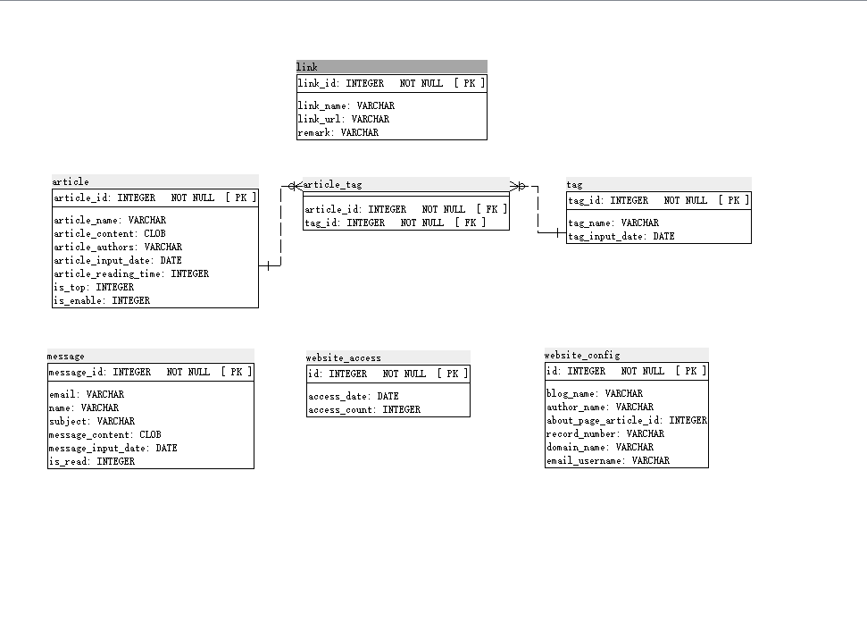
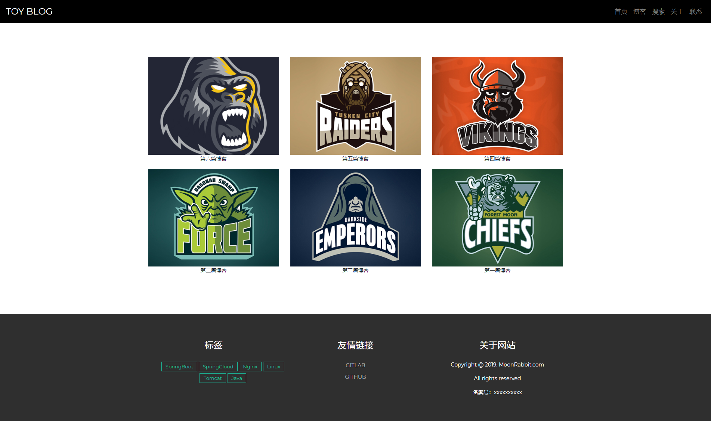
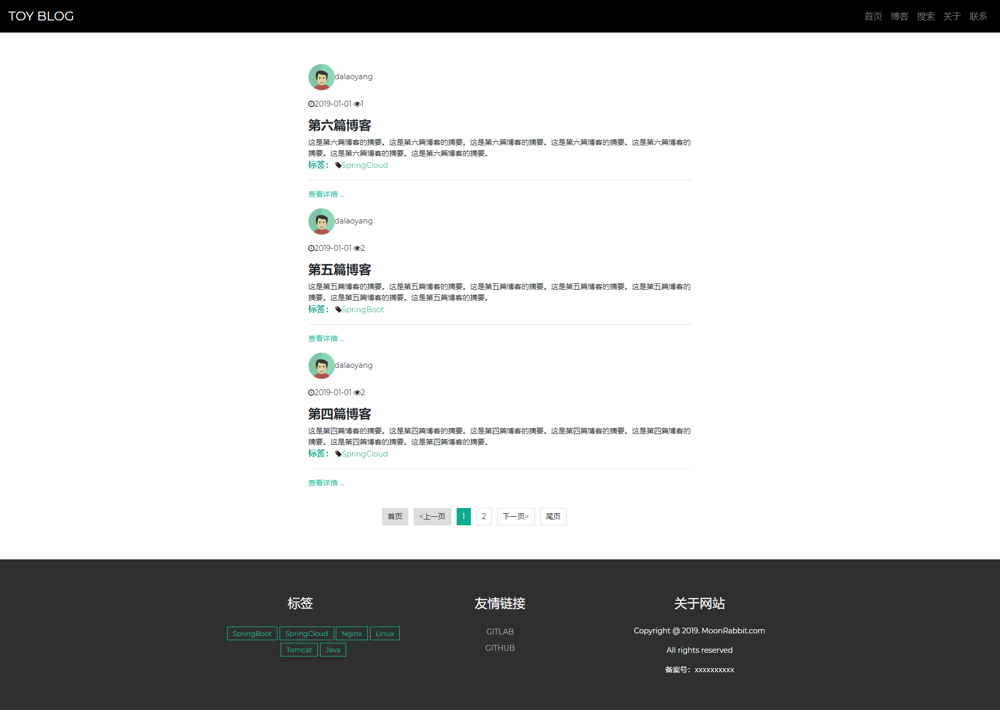
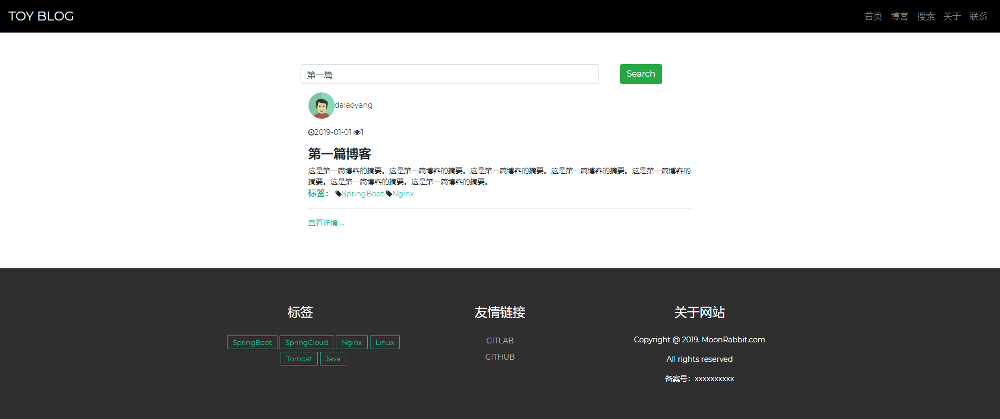
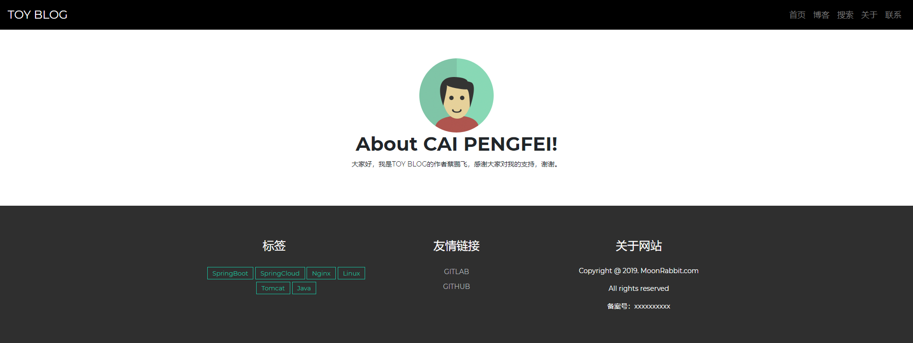
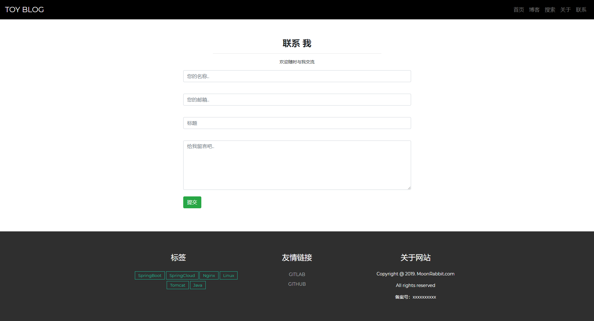
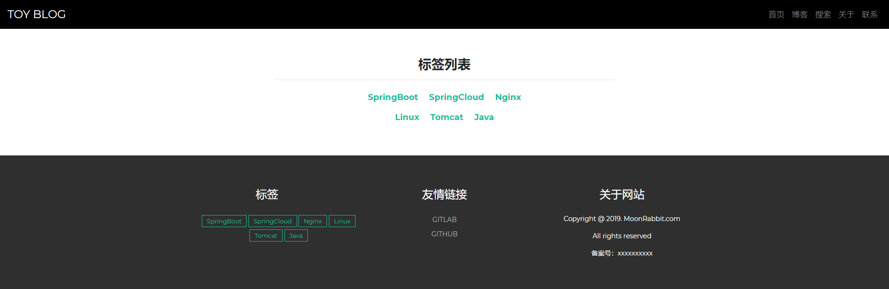
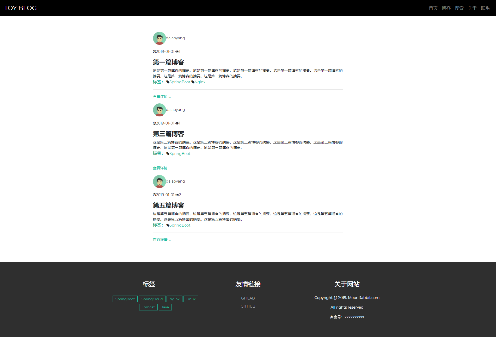
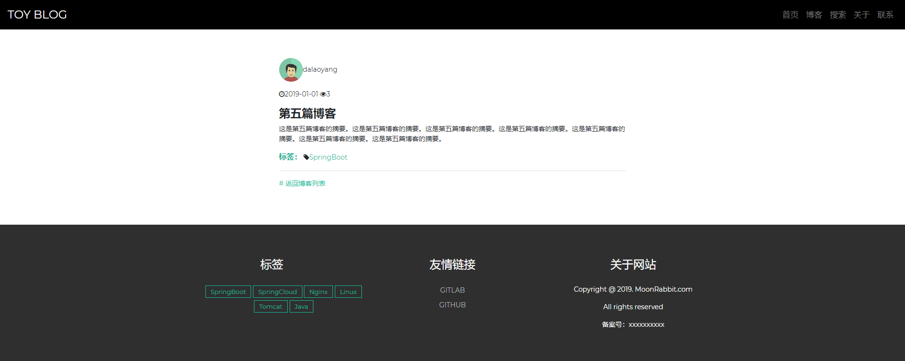

# TOY BLOG
> 作者：蔡鹏飞

**声明**：本作品为个人自学所做的练习，有部分改动。博客原作品原链接为：https://gitee.com/dalaoyang/springboot_book。

### 1. 简介
博客功能主要包含
- **首页**：首页显示地内容为博客中最后置顶的6篇文章。
- **博客页**：显示所有博客文章，显示内容包括文章标题，作者，头像，文章简介，并进行分页处理。
- **搜索页**：根据关键词搜索相应文章。
- **关于页**：显示博主的介绍，可以根据系统配置，设置一片文章作为关于页内容。
- **联系页**：留言给博主。
- **标签列表页**：显示所有标签。
- **标签对应博客页**：单击标签后，显示标签对应的博客列表。暂无分页。
- **文章详情页**：显示文章的详细内容。

本博客主要使用thymeleaf和JPA。前端部分使用js，html, css。 库使用的是jquery3，bootstrap4, font-awesome。

用到的辅助功能有拦截器（HandlerInterceptorAdaptor)，定时器（@Schdueled），以及初始化（@postConstruct）。

### 2. 使用
在mysql中创建数据库
```sql
CREATE DATABASE toyBlog;
```
并在项目的`application.yml`修改对应的数据库配置
然后运行程序即可。
###  3. 数据库结构


### 4. 效果展示
- **首页：**



- **博客页：**



- **搜索页：**



- **关于页：**



- **联系页：**



- **标签列表页：**



- **标签对应博客页：**



- **文章详情页：**


